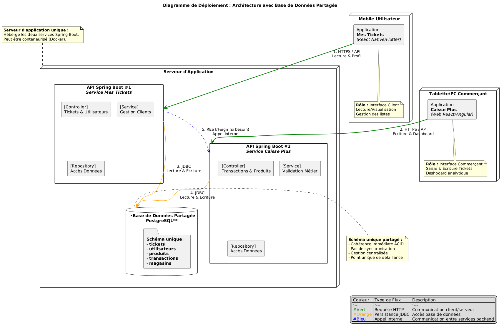
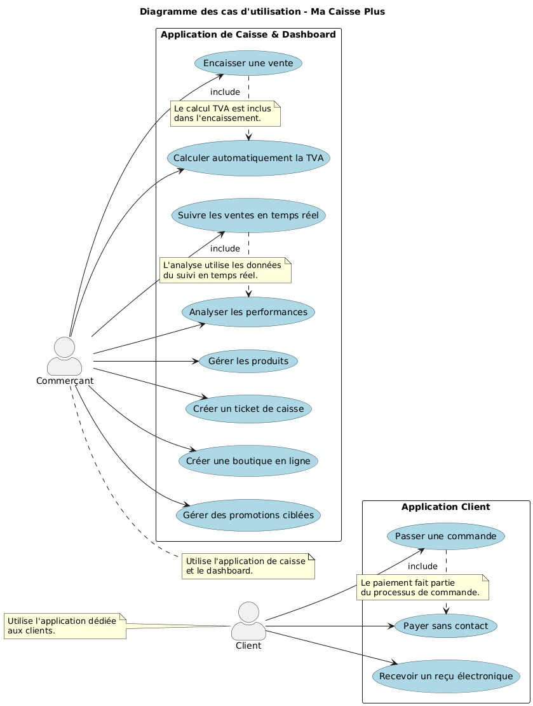

# **Ma Caisse Plus - Documentation Technique**


## 📋 Table des Matières
- [Aperçu du Projet](#aperçu-du-projet)
- [Fonctionnalités Principales](#fonctionnalités-principales)
- [Architecture Technique](#architecture-technique)
- [Cas d'Utilisation](#cas-dutilisation)
- [Installation & Déploiement](#installation--déploiement)
- [API Documentation](#api-documentation)
- [Screenshots](#screenshots)
- [Contribution](#contribution)

---

## 🎯 Aperçu du Projet

**Ma Caisse Plus** est une solution complète de dématérialisation des tickets de caisse qui connecte les commerçants et leurs clients via une plateforme numérique moderne. Le projet élimine les tickets papier tout en offrant une expérience enrichie pour les deux parties.

### Objectifs Principaux
- ✅ **Écologie** : Réduction de l'impact environnemental
- ✅ **Convenience** : Accès numérique aux tickets de caisse
- ✅ **Analytics** : Données précieuses pour les commerçants
- ✅ **Modernisation** : Transformation digitale du commerce local

---

## ✨ Fonctionnalités Principales

### Pour les Clients 📱
| Fonctionnalité | Description |
|---------------|-------------|
| **Application Mobile** | Interface dédiée "Mes Tickets" |
| **Reçus Électroniques** | Stockage et historique illimité |
| **Promotions Ciblées** | Offres personnalisées |

### Pour les Commerçants 💼
| Fonctionnalité | Description |
|---------------|-------------|
| **Caisse Numérique** | Interface web optimisée tablette/PC |
| **Dashboard Analytique** | Suivi en temps réel et rapports |
| **Gestion Produits** | Catalogue digital avec synchronisation |
| **Boutique En Ligne** | Création de vitrine numérique intégrée |
| **Calcul TVA Automatique** | Conformité fiscale simplifiée |

---

## 🏗️ Architecture Technique

### Diagramme d'Architecture Global


### Stack Technologique

| Couche | Technologies |
|--------|--------|
| **Frontend Client** | Flutter |
| **Frontend Commerçant** | Angular |
| **Backend** | Spring Boot, Java, Spring Security |
| **Base de Données** | PostgreSQL, Hibernate JPA |
| **Infrastructure** | Docker |
| **Sécurité** | JWT, HTTPS, Validation des inputs |

---

## 📊 Cas d'Utilisation

### Diagramme des Cas d'Utilisation


### Flux Utilisateurs Détail

#### **Flux Client**
1. **Scan QR Code** en magasin
2. **Sélection produits** dans l'application
4. **Réception automatique** du ticket électronique
5. **Historique consultable** à tout moment

#### **Flux Commerçant**
2. **Import/Scan** des produits
4. **Suivi dashboard** des performances
5. **Création de promotions** ciblées

---


## 🔗 API Documentation

### Exemple des Endpoints

#### **Service Mes Tickets (Client)**
| Méthode | Endpoint | Description |
|---------|----------|-------------|
| `GET` | `/api/v1/tickets/user/{userId}` | Liste des tickets client |
| `GET` | `/api/v1/tickets/{ticketId}` | Détail d'un ticket |
| `POST` | `/api/v1/tickets/{ticketId}/share` | Partager un ticket |
| `GET` | `/api/v1/users/profile` | Profil utilisateur |

#### **Service Caisse Plus (Commerçant)**
| Méthode | Endpoint | Description |
|---------|----------|-------------|
| `POST` | `/api/v1/transactions` | Créer une transaction |
| `GET` | `/api/v1/dashboard/stats` | Statistiques dashboard |
| `POST` | `/api/v1/products` | Ajouter un produit |
| `GET` | `/api/v1/analytics/sales` | Analyse des ventes |

### Exemple de Requête
```bash
# Obtenir les tickets d'un client
curl -X GET "https://api.macaisseplus.com/api/v1/tickets/user/123" \
  -H "Authorization: Bearer {jwt_token}"
```

### Exemple de Réponse
```json
{
  "status": "success",
  "data": {
    "tickets": [
      {
        "id": "TKT-2024-001",
        "store": "Boulangerie Du Pain",
        "date": "2024-01-15T10:30:00Z",
        "amount": 12.50,
        "items": [
          {"name": "Baguette", "price": 1.20, "quantity": 2},
          {"name": "Croissant", "price": 1.10, "quantity": 3}
        ],
        "taxAmount": 1.04,
        "paymentMethod": "CARD",
        "digitalReceiptUrl": "https://receipts.macaisseplus.com/TKT-2024-001"
      }
    ]
  }
}
```

---

## 📱 Screenshots

### Application Mobile "Mes Tickets"

*Interface client*

*Interface de Commerçant*

---

### Standards de Code
- **Backend** : Respecter les conventions Spring Boot
- **Frontend** : ESLint + Prettier configurés
- **Tests** : Minimum 80% de couverture
- **Documentation** : Mise à jour obligatoire

### Structure du Projet
```
ma-caisse-plus/
├── backend/
│   ├── service-mes-tickets/
│   ├── service-caisse-plus/
│   └── shared-database/
├── frontend-client/
├── frontend-merchant/
├── mobile-app/
├── docker/
└── docs/
```

---

**Version :** 1.0.5  
**Dernière mise à jour :** Janvier 2025  
**Statut :** 🟢 En Production

